# VUE CRM FRONTEND

Modern Open Source CRM Admin Template built with Vue 3 + CoreUI + Vite.

---

# ✨ Overview

CRM is a modern and scalable frontend starter template designed specifically for building:

* CRM Systems
* Sales Management Applications
* Customer Management Platforms
* ERP Dashboards
* Internal Business Tools
* Enterprise Web Applications

Built with clean architecture, dynamic access control, and reusable modules to accelerate enterprise application development.

---

# 🚀 Features

* ⚡ Vue 3 + Vite
* 🎨 CoreUI Admin Dashboard
* 🔐 JWT Authentication
* 🛡 Role & Permission Access Control
* 🧭 Dynamic Sidebar from API
* 👤 User Profile Management
* 📊 CRM Dashboard
* 📁 Report Modules
* 📱 Fully Responsive Design
* 🌙 Dark Mode Ready
* 🧩 Reusable Components
* 📦 Modular Architecture
* 🔄 Axios API Service Layer
* 🧠 Pinia State Management
* 🛣 Vue Router


---

# 🛠 CRM Core Features

## 🔐 Authentication System

* Login
* Logout
* Forgot Password
* JWT Token Authentication
* Route Protection

---

## 🛡 Role & Permission Management

Supports enterprise-grade access control:

* Role-based page access
* Dynamic menu access
* Button-level permission

Permission examples:

```vue
<button v-if="permission.canCreate(currentUrl)">
  Add Data
</button>

<button v-if="permission.canUpdate(currentUrl)">
  Edit
</button>

<button v-if="permission.canDelete(currentUrl)">
  Delete
</button>
```

---

## 🧭 Dynamic Sidebar System

Sidebar menu is generated dynamically from backend API based on user role.

```txt
/sidebar-access/{roleId}
/sidebar-access-submenu
```

No hardcoded menu configuration in frontend.

---

# 🛠 Tech Stack

| Technology   | Description        |
| ------------ | ------------------ |
| Vue 3        | Frontend Framework |
| Vite         | Build Tool         |
| CoreUI       | Admin Dashboard UI |
| Pinia        | State Management   |
| Vue Router   | Routing System     |
| Axios        | HTTP Client        |
| Bootstrap 5  | CSS Framework      |
| Font Awesome | Icons              |

---

# 📦 Installation

Clone repository:

```bash
git clone https://github.com/ApregiPrataYuda/Frontend-CRM
```

Enter project folder:

```bash
cd Template-siap-pakai-vue3-coreUI
```

Install dependencies:

```bash
npm install
```

Run development server:

```bash
npm run dev
```

---

# 🏗 Production Build

```bash
npm run build
```

---

# 📁 Project Structure

```bash
src/
├── assets/
├── components/
├── composables/
├── layouts/
├── router/
├── services/
├── stores/
├── views/
├── App.vue
├── main.js
└── style.css
```

---

# 🔐 Authentication Flow

```txt
/login
   │
   └── POST /api/signIn
           │
           ▼
       fetchMe()
           │
           ├── fetchMenus()
           ├── fetchPermissions()
           │
           ▼
       redirect dashboard
```

---

# 🌱 Environment Variables

Create `.env` file:

```env
VITE_API_URL=http://localhost:8000/api/
```

---

# 📸 Screenshots

## Home Page
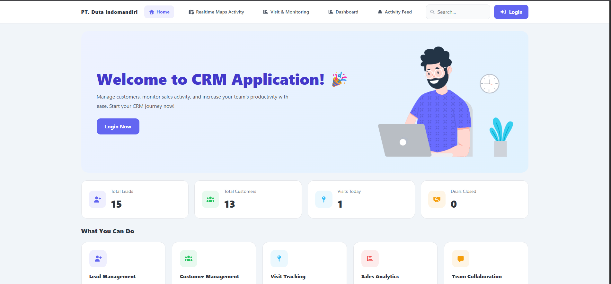

## Maps tracking Page
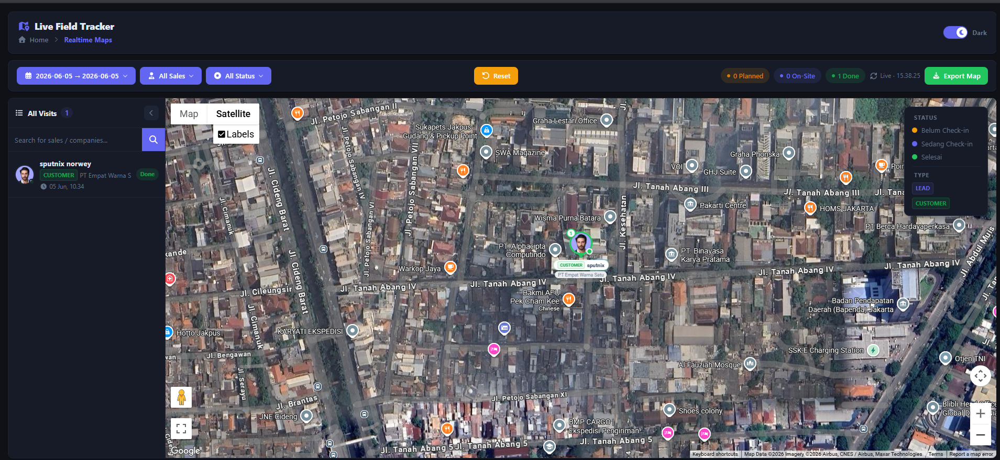

## Dashboard For Company Public  Page
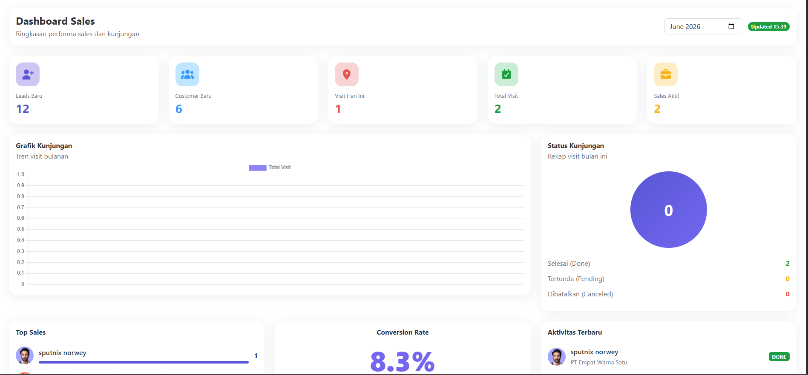


## Monitoring Page
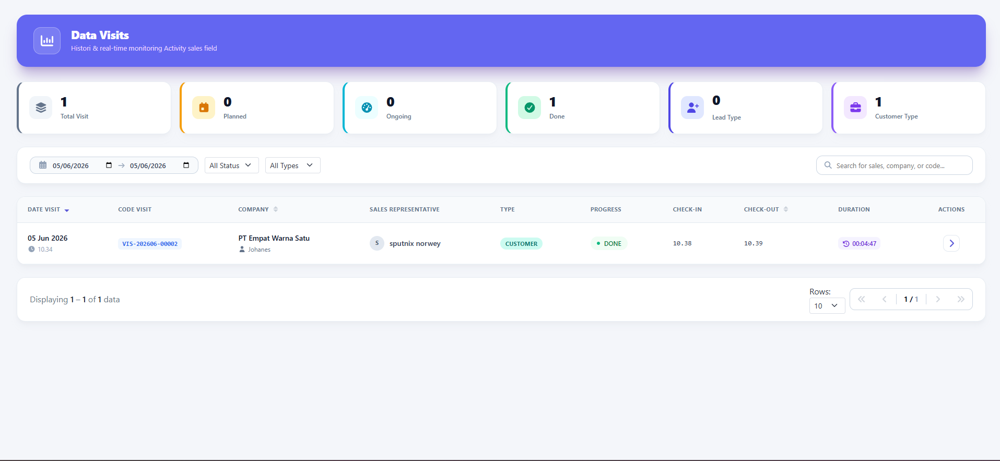


## Activity Feed Page
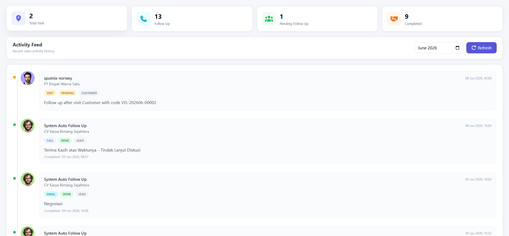

## Login Page
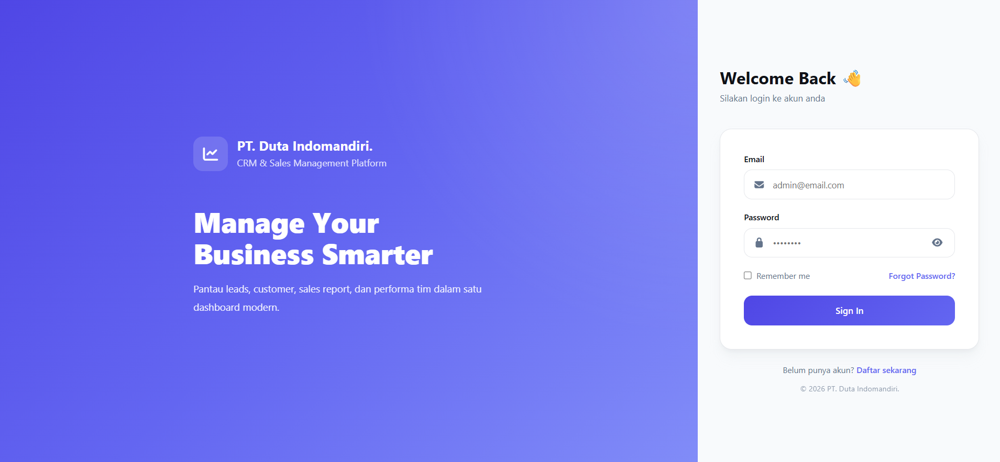


## Register Page
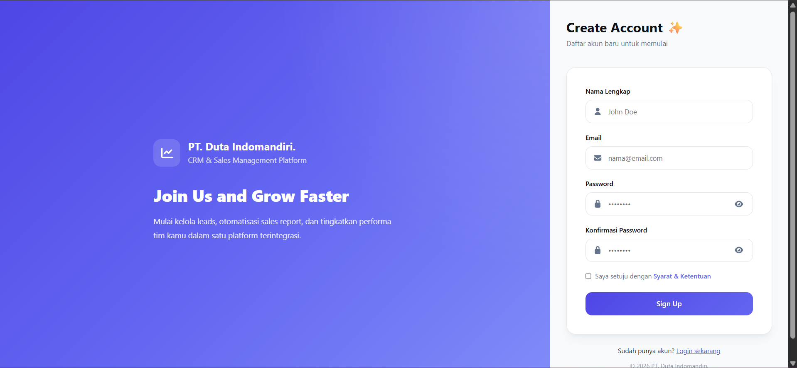


## Forgot PW Page
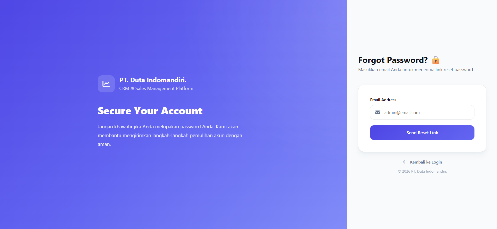


## IT Page Account
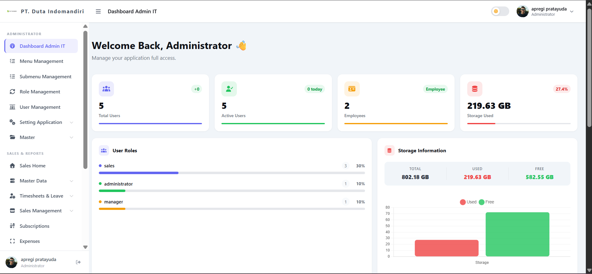

## Sales Page Account
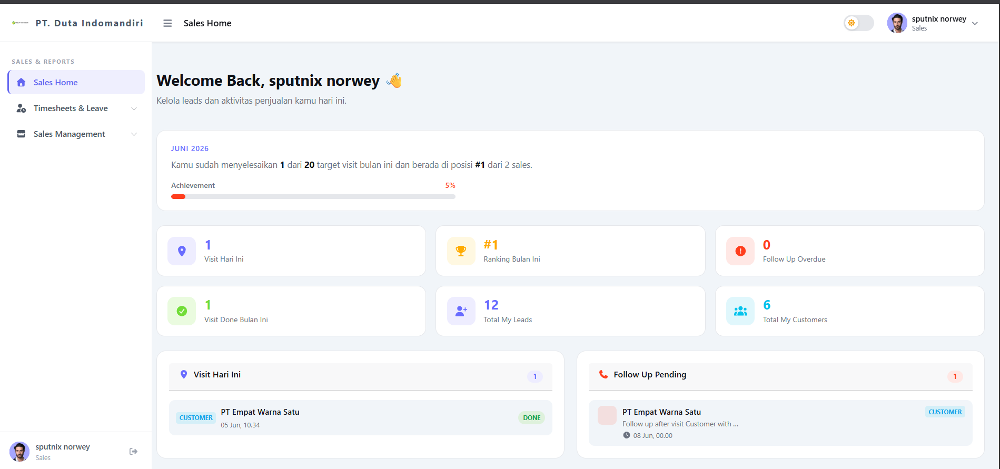

## manager Page Account
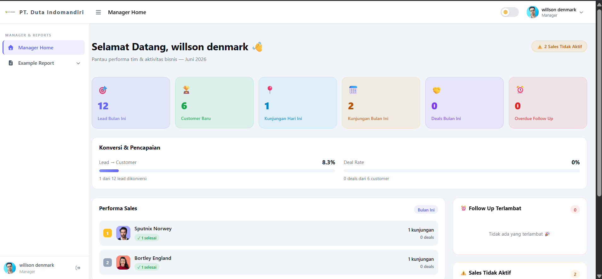

## User Profile
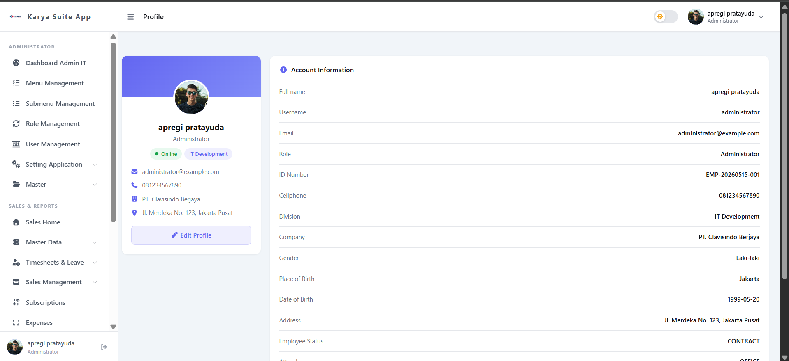

## and many other features
---

# 📌 Roadmap

* [x] JWT Authentication
* [x] Role & Permission System
* [x] Dynamic Sidebar Menu
* [x] User Profile Management
* [x] Dashboard Layout
* [x] Auto Refresh Token
* [x] Reusable Data Table
* [x] Notification System
* [x] Multi Language Support
* [x] CRM Analytics Widgets
* [x] Dark Mode Optimization

---

# 🤝 Contributing

Contributions are welcome.

Feel free to:

* Fork this repository
* Create feature branches
* Submit pull requests
* Open issues

---

# 📄 License

MIT License

Copyright (c) 2026 Apregi Prata Yuda

---

# 👨‍💻 Author

Developed and maintained by **Apregi Prata Yuda**

GitHub:
https://github.com/ApregiPrataYuda

Instagram:
https://www.instagram.com/kirey234/

---

# ⭐ Support

If you like this project:

* Give this repository a ⭐
* Fork and customize it
* Share with other developers

---

Built with ❤️ using Vue 3 + CoreUI
